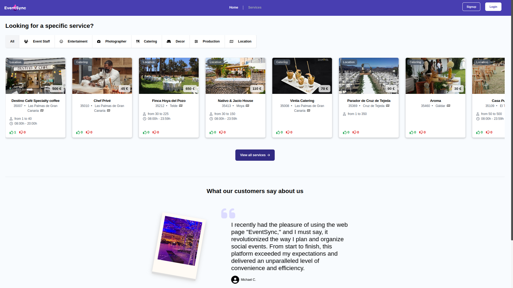

# EventSync

EventSync is a web application that simplifies the process of searching for event services, creating events, managing reservations, and keeping track of event budgets. With EventSync, you can effortlessly plan and organize your events, ensuring a seamless experience for both event organizers and service providers.

## Table of Contents
- [Usage](#usage)
- [Prerequisites](#prerequisites)
- [Installation](#installation)
- [Author](#author)
- [Technologies Used](#technologies-used)
- [Contributing](#contributing)
- [Project Link](#project-link)
- [License](#license)
- [Web Preview](#web-preview)

## Usage

- User registration and login functionality.
- Home page showcasing service offers and user reviews.
- Event creation with title, date, and time.
- Service selection and request submission.
- Service owner approval and integration with event pricing.
- Total price calculation and expense tracking.
- Resume page displaying selected services and total cost.
- Guest list management.

## Prerequisites
To run this application, make sure you have the back-end of the app:
```
https://github.com/gcarolina03/eventSync-backend
```

Start the backend server with the following command: **`npm start`**

## Installation
To install and run the front-end app locally, follow these steps:

1. Clone this repository to your local machine.
2. Navigate to the project's root directory and install the necessary dependencies by running the following command: **`npm i`**
3. Create a **`.env`** file based on the provided **`.env.example`** file. Specify the values for the environment variables required by the application to work.
4. Once the installation is complete, start the development server with the following command: **`npm run dev`**

After completing these steps, you should have both the front-end and backend of EventSync app up and running locally.

5. Open your web browser and visit **`http://localhost:3000`** to access the app.

## Author
EventSync was created by:

- Carolina (https://github.com/gcarolina03)

## Technologies Used
- **Next.js**: React framework for server-side rendering and static site generation.
- **Tailwind CSS**: Utility-first CSS framework for building responsive designs.
- **Axios**: A JavaScript library used to make HTTP requests from the front-end to the backend server and connect to the database.
- **Google Maps Platform**: Platform for integrating maps and location-based services.


## Contributing
If you would like to contribute to EventSync, please submit a pull request with your changes. We welcome contributions of all kinds, including bug fixes, feature additions, and general improvements.


## Project Link
You can find the project on GitHub at: https://github.com/gcarolina03/eventSync-frontend


## License
This project is licensed under the [MIT License](LICENSE).

## Web Preview
